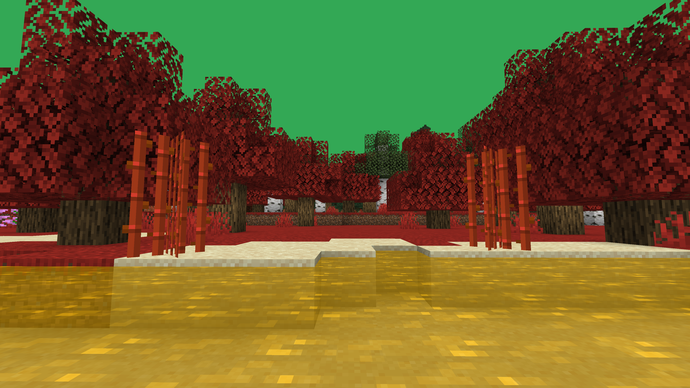

# Minecraft Biome Colour Generator

---

This can be used to generate a datapack custom biome colours that you can apply to your world

This tool does not automatically add biomes to your world and only sets the colours not the full biome settings!
You must use worldedit or a similar tool to apply the biomes to an area.




### Instructions

- Run the program and make the biomes you want

- Open the output folder

- Select data and pack.mcmeta

- right click and compress to zip archive

- Place this zip file in saves/YourWorldName/datapacks

- Apply the biome to an area with another tool such as world edit

Worldedit Example Command:
```
/br biome sphere biome_colours:<name of json>
```

- You may have to leave and rejoin the world to see the changes
